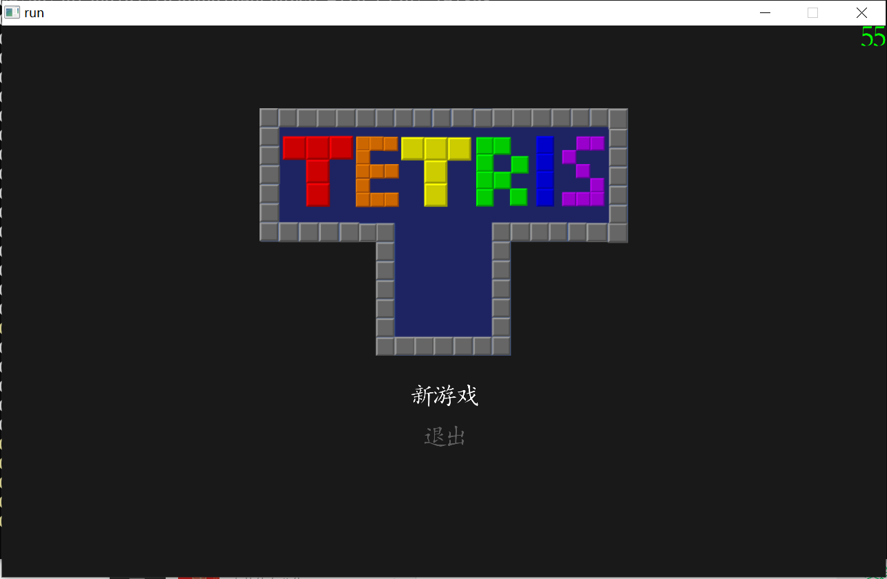
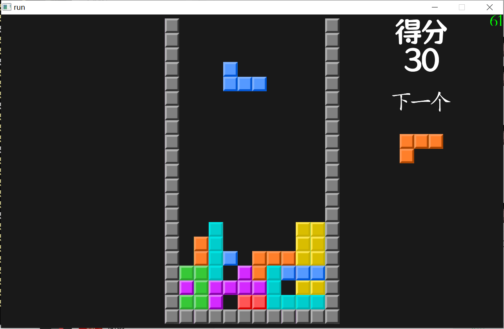

# Tetris 
由purple紫电引擎开发的俄罗斯方块Tetris

 
 

### 开发语言
    C++

### 支持平台
- Windows
- MacOS
- Ubuntu
- RaspiBerry

### 构建

#### 依赖
- 编译器工具链
    - windows:MingW
    - MacOS: Clang
    - Linux: gcc/g++ 
    - RaspiBerry: gcc/g++
  
- cmake
  
#### 构建步骤

#### Windows  
    cd Tetris
    mkdir build 
    cd build
    cmake .. -G"Unix Makefiles"
    cmake --build . -j
    ./app

#### MacOS
    cd Tetris
    mkdir build && cd build
    cmake .. 
    cmake --build . -j
    ./app

#### Linux/ RaspiBerry
    cd Tetris
    mkdir build && cd build
    cmake .. 
    cmake --build . -j
    ./app

